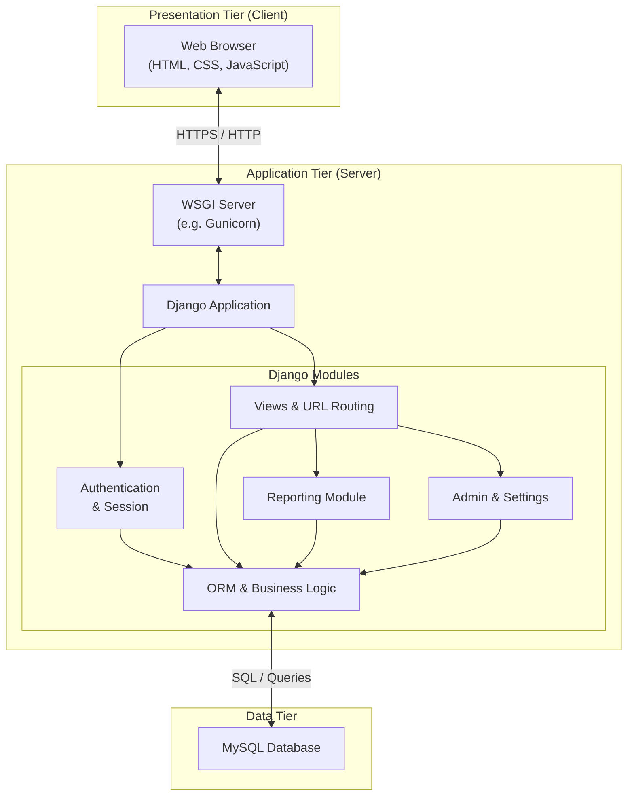
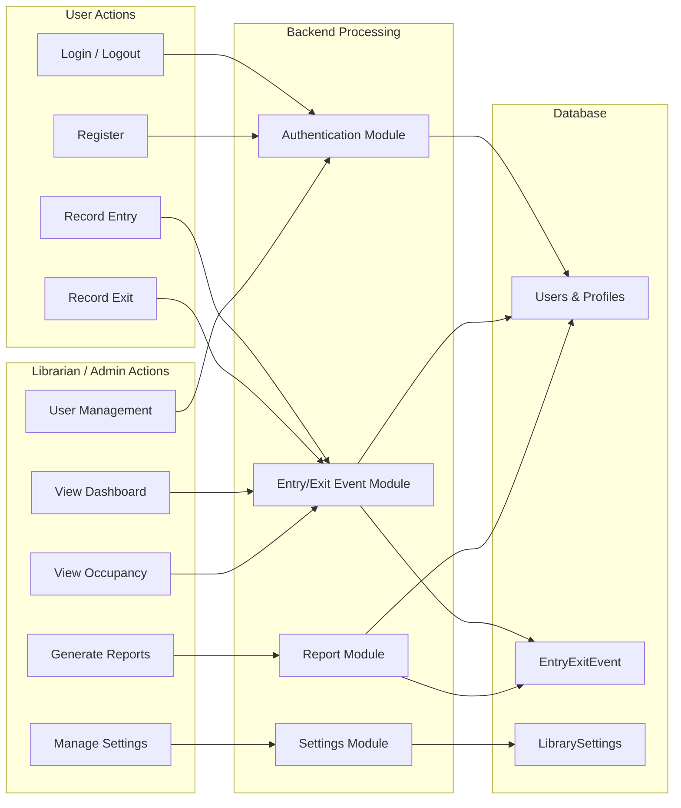
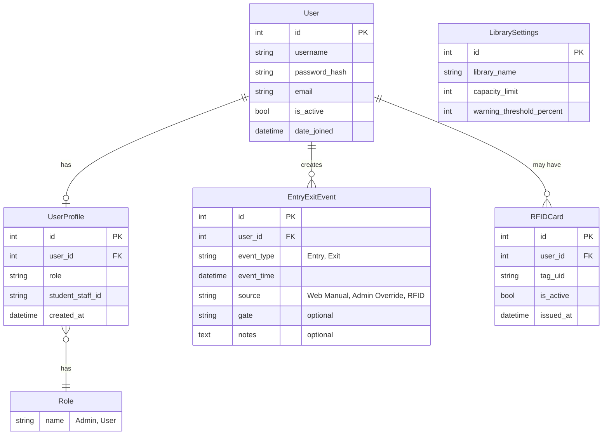
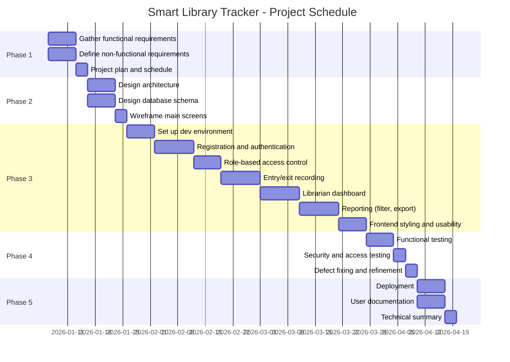

# SMART LIBRARY TRACKER  
## Appendices to Project Documentation

**Project:** Smart Library Tracker  
**Document:** Appendices A–E  
**Version:** 1.0  
**Date:** February 2026  

---

## Appendix A: Architecture Diagram

The Smart Library Tracker follows a three-tier web architecture. The diagram below shows all system components, modules, and their interactions.

### A.1 High-Level Architecture (Mermaid)

### A.2 Component Interaction Diagram (Mermaid)

### A.3 Textual Description of Components

| Tier        | Component        | Responsibility |
|------------|-------------------|----------------|
| Presentation | Web Browser      | Renders UI, sends HTTP requests, handles client-side validation and navigation. |
| Application | WSGI Server       | Receives HTTP requests and passes them to the Django application. |
| Application | Django (Auth)     | Login, logout, registration, session management, role-based access control. |
| Application | Django (Views)    | URL routing, request handling, rendering templates, returning responses. |
| Application | Django (ORM)      | Database access, business logic (e.g. validate entry/exit sequence, compute occupancy). |
| Application | Reporting Module  | Build queries for daily/weekly reports, aggregate data, export. |
| Application | Admin/Settings    | Library settings (name, capacity, threshold), user list and management. |
| Data        | MySQL             | Persistent storage for users, profiles, roles, events, and library settings. |

Data flow: **User action (browser)** → **WSGI** → **Django (auth + view)** → **ORM** → **MySQL**; response flows back as HTML/JSON to the browser.

---

## Appendix B: ERD (Entity-Relationship Diagram)

All entities, attributes, and relationships for the Smart Library Tracker database are listed below. The design supports users, roles, attendance events, and library configuration.

### B.1 Entity-Relationship Diagram (Mermaid)

### B.2 Entities, Attributes, and Relationships (Text)

#### Entity: **User** (auth_user / Django default)

| Attribute     | Type     | Description                    |
|---------------|----------|--------------------------------|
| id            | PK, int  | Primary key                    |
| username      | string   | Unique login name              |
| password      | string   | Hashed password                |
| email         | string   | Email address                  |
| is_active     | boolean  | Account active flag            |
| date_joined   | datetime | Registration timestamp         |

**Relationships:** One-to-one with UserProfile; one-to-many with EntryExitEvent; one-to-many with RFIDCard.

---

#### Entity: **UserProfile**

| Attribute       | Type     | Description                          |
|-----------------|----------|--------------------------------------|
| id              | PK, int  | Primary key                          |
| user_id         | FK, int  | References User                      |
| role            | string   | e.g. "Admin", "User"                 |
| student_staff_id| string   | Institution ID (optional)            |
| created_at      | datetime | Profile creation time                |

**Relationships:** Many-to-one to User (one profile per user).

---

#### Entity: **EntryExitEvent**

| Attribute   | Type     | Description                              |
|-------------|----------|------------------------------------------|
| id          | PK, int  | Primary key                              |
| user_id     | FK, int  | References User                          |
| event_type  | string   | "Entry" or "Exit"                        |
| event_time  | datetime | Timestamp of event                       |
| source      | string   | "Web Manual", "Admin Override", "RFID"  |
| gate        | string   | Optional gate/location                   |
| notes       | text     | Optional notes                           |

**Relationships:** Many-to-one to User.  
**Indexes (recommended):** event_time, user_id, event_type (for occupancy and report queries).

---

#### Entity: **RFIDCard** (optional / future)

| Attribute  | Type     | Description           |
|------------|----------|-----------------------|
| id         | PK, int  | Primary key           |
| user_id    | FK, int  | References User       |
| tag_uid    | string   | RFID tag identifier   |
| is_active  | boolean  | Card active flag      |
| issued_at  | datetime | Issue timestamp       |

**Relationships:** Many-to-one to User (one active card per user by constraint).

---

#### Entity: **LibrarySettings** (singleton)

| Attribute                  | Type   | Description                    |
|----------------------------|--------|--------------------------------|
| id                         | PK, int| Primary key                    |
| library_name               | string | Display name of library        |
| capacity_limit             | int    | Maximum occupants              |
| warning_threshold_percent  | int    | e.g. 80 for 80% capacity alert |

**Relationships:** None (single configuration row).

---

### B.3 Relationship Summary

| From           | To               | Cardinality | Description                    |
|----------------|------------------|-------------|--------------------------------|
| User           | UserProfile      | 1:1         | Each user has one profile      |
| User           | EntryExitEvent   | 1:N         | User has many events           |
| User           | RFIDCard         | 1:N         | User may have multiple cards   |
| UserProfile    | Role             | N:1 (logical) | Profile stores role name     |
| LibrarySettings| —                | Singleton   | One row for library config     |

---

## Appendix C: Wireframes

Key screens are described with layout, main elements, and navigation flow. These can be used to generate visual wireframes or as reference for implementation.

### C.1 Home / Landing

**Purpose:** First screen for unauthenticated users; entry point to login or register.

**Layout:**
- Header: Application title “Smart Library Tracker”, optional logo.
- Main: Short tagline and two primary actions: **Login** and **Register**.
- Footer: Institution name (e.g. University of Education, Winneba), optional links.

**Main elements:**
- “Login” button/link → Login page.
- “Register” button/link → Registration page.

**Navigation flow:** Home → Login **or** Home → Register.

---

### C.2 Login

**Purpose:** Authenticate users and redirect by role (user dashboard or admin dashboard).

**Layout:**
- Header: “Smart Library Tracker” and “Login”.
- Form: Username (text), Password (password), “Remember me” (optional), “Login” submit button.
- Link: “Don’t have an account? Register”.
- Error area: Display invalid-credentials or validation messages.

**Main elements:**
- Username input, password input, submit, link to registration.

**Navigation flow:** Login (success) → User Dashboard (role=User) or Admin Dashboard (role=Admin). Login (fail) → stay on Login with error. Link → Register.

---

### C.3 User Dashboard (Entry/Exit – “Borrow/Return” equivalent)

**Purpose:** Allow students and staff to record library **entry** and **exit**.

**Layout:**
- Header: “Smart Library Tracker”, user name, “Logout”.
- Main: Two clear actions: “Record Entry” and “Record Exit”.
- Status: Message such as “You last recorded: Entry at 10:00 AM” to guide next action and avoid duplicates.
- Optional: Short instructions.

**Main elements:**
- “Record Entry” button, “Record Exit” button, last-event message, logout.

**Navigation flow:** User Dashboard → (Record Entry or Record Exit) → confirmation message, stay on dashboard. Logout → Login/Home.

---

### C.4 Admin Dashboard (Overview)

**Purpose:** Librarian/administrator overview after login.

**Layout:**
- Sidebar or top nav: Dashboard, Current Occupancy, Entries Today, Exits Today, Capacity Level, Reports (Daily, Weekly), Settings, User Management, Logout.
- Main: Summary cards or list: current occupancy count, entries today, exits today, capacity (e.g. 350/500). Quick links to detailed views and reports.

**Main elements:**
- Summary figures, links to Current Occupancy, Entries/Exits today, Capacity, Reports, Settings, User Management.

**Navigation flow:** Admin Dashboard ↔ all other admin pages via sidebar/top nav.

---

### C.5 Current Occupancy (Catalog of present users)

**Purpose:** Show who is currently inside the library (last event = Entry, no subsequent Exit).

**Layout:**
- Same admin navigation as C.4.
- Title: “Current Occupancy”.
- Table or list: User (name/ID), time of last Entry, optional notes. Optional filters/search.

**Main elements:**
- Table/list of current occupants, optional export.

**Navigation flow:** Access from Admin Dashboard; return via nav.

---

### C.6 Reports

**Purpose:** View and export attendance data by date or week.

**Layout:**
- Same admin navigation.
- **Daily report:** Date picker, “Generate” → table of events (user, event_type, event_time, source) and summary (total entries, total exits). Export (e.g. CSV/PDF) option.
- **Weekly report:** Week selector, “Generate” → aggregated data (e.g. daily totals or day-by-day breakdown). Export option.

**Main elements:**
- Date/week selectors, generate button, results table, summary stats, export control.

**Navigation flow:** From Admin Dashboard or Reports menu; stay on same report page with new data on generate.

---

### C.7 User Management

**Purpose:** Administrators view and manage registered users.

**Layout:**
- Same admin navigation.
- Title: “User Management” or “Users”.
- Table: Username, email, role, student_staff_id (if any), date_joined, is_active. Optional: search, filter by role, link to edit/deactivate (if implemented).

**Main elements:**
- User list table, optional search/filter, optional actions per row.

**Navigation flow:** From Admin Dashboard or User Management link.

---

### C.8 Settings

**Purpose:** Configure library-wide settings.

**Layout:**
- Same admin navigation.
- Form: Library name (text), Capacity limit (number), Warning threshold % (number). “Save” button. Success/error message.

**Main elements:**
- Three fields and Save; message area.

**Navigation flow:** From Admin Dashboard or Settings link.

---

### C.9 Global Navigation Summary

| User type   | From          | To                          |
|------------|----------------|-----------------------------|
| Guest      | Home           | Login, Register             |
| User       | User Dashboard | Record Entry/Exit, Logout   |
| Admin      | Admin Dashboard| Occupancy, Entries/Exits today, Capacity, Daily/Weekly Reports, Settings, User Management, Logout |

---

## Appendix D: Gantt Chart

Tasks, durations, and dependencies in a structure suitable for conversion into a Gantt chart (e.g. in MS Project, Excel, or Mermaid).

### D.1 Task List with Durations and Dependencies

| Task ID | Task Name                           | Duration | Dependencies | Phase        |
|---------|-------------------------------------|----------|--------------|-------------|
| T1      | Gather and document functional requirements | 1 week  | —            | Phase 1     |
| T2      | Define non-functional requirements  | 1 week  | —            | Phase 1     |
| T3      | Produce project plan and schedule   | 0.5 week| T1, T2       | Phase 1     |
| T4      | Design overall architecture         | 1 week  | T3           | Phase 2     |
| T5      | Design database schema              | 1 week  | T3           | Phase 2     |
| T6      | Wireframe main screens              | 0.5 week| T4           | Phase 2     |
| T7      | Set up dev environment (Django, DB, VCS) | 1 week | T4, T5, T6   | Phase 3     |
| T8      | Implement registration and authentication | 1.5 weeks | T7        | Phase 3     |
| T9      | Implement role-based access control | 1 week  | T8           | Phase 3     |
| T10     | Implement entry/exit recording and persistence | 1.5 weeks | T7, T9   | Phase 3     |
| T11     | Build librarian dashboard (overview, stats) | 1.5 weeks | T9, T10  | Phase 3     |
| T12     | Implement reporting (filter, export) | 1.5 weeks | T11        | Phase 3     |
| T13     | Frontend styling and usability      | 1 week  | T8–T12      | Phase 3     |
| T14     | Functional testing of all features  | 1 week  | T13         | Phase 4     |
| T15     | Access control and security testing | 0.5 week| T14         | Phase 4     |
| T16     | Defect fixing and UI refinement     | 0.5 week| T14, T15    | Phase 4     |
| T17     | Deploy application / prepare deployment instructions | 1 week | T16   | Phase 5     |
| T18     | Write user documentation            | 1 week  | T16         | Phase 5     |
| T19     | Write technical summary for report  | 0.5 week| T17, T18    | Phase 5     |

### D.2 Gantt Chart (Mermaid)

### D.3 Phase Timeline (Weeks 1–14)

| Phase   | Weeks  | Main tasks (by ID)     |
|---------|--------|-------------------------|
| Phase 1 | 1–2    | T1, T2, T3              |
| Phase 2 | 3–4    | T4, T5, T6              |
| Phase 3 | 5–10   | T7–T13                  |
| Phase 4 | 11–12  | T14, T15, T16           |
| Phase 5 | 13–14  | T17, T18, T19           |

### D.4 Prompt for AI Gantt Chart Tools

Copy the block below into an AI Gantt chart generator (e.g. ChatGPT, Claude, or a Gantt-specific app) to produce a Gantt chart for this project.

---

**PROMPT (copy from here):**

Create a Gantt chart for the following project.

**Project name:** Smart Library Tracker  
**Total duration:** 14 weeks  
**Suggested start date:** January 6, 2026 (or “Week 1” if the tool uses relative dates)

**Tasks, durations, and dependencies:**

**Phase 1 – Requirement analysis and planning (Weeks 1–2)**  
- T1: Gather and document functional requirements — 1 week — no dependencies  
- T2: Define non-functional requirements — 1 week — no dependencies  
- T3: Produce project plan and schedule — 3 days — depends on T1, T2  

**Phase 2 – System design (Weeks 3–4)**  
- T4: Design overall architecture — 1 week — depends on T3  
- T5: Design database schema — 1 week — depends on T3  
- T6: Wireframe main screens — 3 days — depends on T4  

**Phase 3 – Development (Weeks 5–10)**  
- T7: Set up development environment (Django, database, version control) — 1 week — depends on T4, T5, T6  
- T8: Implement registration and authentication — 10 days — depends on T7  
- T9: Implement role-based access control — 1 week — depends on T8  
- T10: Implement entry/exit recording and persistence — 10 days — depends on T7, T9  
- T11: Build librarian dashboard (overview, statistics) — 10 days — depends on T9, T10  
- T12: Implement reporting (filter by date, export) — 10 days — depends on T11  
- T13: Frontend styling and usability — 1 week — depends on T12  

**Phase 4 – Testing (Weeks 11–12)**  
- T14: Functional testing of all main features — 1 week — depends on T13  
- T15: Access control and security testing — 3 days — depends on T14  
- T16: Defect fixing and UI refinement — 3 days — depends on T14, T15  

**Phase 5 – Deployment and documentation (Weeks 13–14)**  
- T17: Deploy application / prepare deployment instructions — 1 week — depends on T16  
- T18: Write user documentation — 1 week — depends on T16  
- T19: Write technical summary for report — 3 days — depends on T17, T18  

**Requirements for the Gantt chart:**  
- Show all 19 tasks with correct durations and dependency links.  
- Group or color tasks by the 5 phases above.  
- Use a weekly time scale over 14 weeks.  
- Indicate the critical path if the tool supports it (path through T1→T3→T4→T7→T8→T9→T10→T11→T12→T13→T14→T16→T17/T18→T19).

**End of prompt.**

---

## Appendix E: Test Cases

Test cases for major features: Authentication, Entry/Exit Recording (Borrow/Return equivalent), User Management, and Reports. Format: ID, description, preconditions, steps, expected results, status.

### E.1 Authentication

| Field | Content |
|-------|--------|
| **ID** | TC-AUTH-001 |
| **Description** | Valid user can log in and is redirected by role (User vs Admin). |
| **Preconditions** | User exists with known username/password; UserProfile has role "User" or "Admin". |
| **Steps** | 1. Open Login page. 2. Enter valid username and password. 3. Click Login. |
| **Expected results** | Login succeeds; user with role "User" is redirected to User Dashboard; user with role "Admin" is redirected to Admin Dashboard. |
| **Status** | Not run |

| Field | Content |
|-------|--------|
| **ID** | TC-AUTH-002 |
| **Description** | Invalid credentials show error and do not log in. |
| **Preconditions** | Login page is displayed. |
| **Steps** | 1. Enter invalid username or password. 2. Click Login. |
| **Expected results** | Error message (e.g. "Invalid credentials"); user remains on Login page and is not authenticated. |
| **Status** | Not run |

| Field | Content |
|-------|--------|
| **ID** | TC-AUTH-003 |
| **Description** | New user can register and then log in. |
| **Preconditions** | Registration page is accessible. |
| **Steps** | 1. Open Register page. 2. Enter username, email, password (and optionally student_staff_id). 3. Submit. 4. Open Login and log in with same credentials. |
| **Expected results** | Registration succeeds; user can log in and is redirected to User Dashboard (default role User). |
| **Status** | Not run |

| Field | Content |
|-------|--------|
| **ID** | TC-AUTH-004 |
| **Description** | Logout clears session and returns user to login or home. |
| **Preconditions** | User is logged in. |
| **Steps** | 1. Click Logout. |
| **Expected results** | Session ended; user is redirected to Login or Home; protected pages are no longer accessible without logging in again. |
| **Status** | Not run |

---

### E.2 Entry/Exit Recording (Borrow/Return)

| Field | Content |
|-------|--------|
| **ID** | TC-ENTRY-001 |
| **Description** | Logged-in user can record Entry and one event is stored. |
| **Preconditions** | User with role "User" is logged in; User Dashboard is displayed. |
| **Steps** | 1. Click "Record Entry". 2. Confirm if prompted. |
| **Expected results** | Success message; one EntryExitEvent with event_type=Entry and current timestamp is created; dashboard shows last event (e.g. "You last recorded: Entry at …"). |
| **Status** | Not run |

| Field | Content |
|-------|--------|
| **ID** | TC-ENTRY-002 |
| **Description** | Logged-in user can record Exit after Entry; event is stored. |
| **Preconditions** | User has at least one Entry recorded (last event is Entry); user is on User Dashboard. |
| **Steps** | 1. Click "Record Exit". 2. Confirm if prompted. |
| **Expected results** | Success message; one EntryExitEvent with event_type=Exit and current timestamp is created; dashboard shows "You last recorded: Exit at …". |
| **Status** | Not run |

| Field | Content |
|-------|--------|
| **ID** | TC-ENTRY-003 |
| **Description** | Entry and Exit appear in "Entries today" and "Exits today" for admin. |
| **Preconditions** | Admin is logged in; at least one Entry and one Exit exist for today. |
| **Steps** | 1. Open "Entries today". 2. Open "Exits today". |
| **Expected results** | Entries today list shows the Entry with correct user and time; Exits today list shows the Exit with correct user and time. |
| **Status** | Not run |

| Field | Content |
|-------|--------|
| **ID** | TC-ENTRY-004 |
| **Description** | Current occupancy list includes only users whose last event is Entry. |
| **Preconditions** | Some users have recorded Entry without a following Exit; admin is logged in. |
| **Steps** | 1. Open Current Occupancy page. |
| **Expected results** | List shows only users whose latest event is Entry; users who have recorded Exit are not listed. |
| **Status** | Not run |

---

### E.3 User Management

| Field | Content |
|-------|--------|
| **ID** | TC-USER-001 |
| **Description** | Admin can open User Management and see list of users. |
| **Preconditions** | Admin is logged in; at least one user exists. |
| **Steps** | 1. Navigate to User Management (or Users list). |
| **Expected results** | Page displays; table or list shows usernames (and optionally email, role, student_staff_id, date_joined). |
| **Status** | Not run |

| Field | Content |
|-------|--------|
| **ID** | TC-USER-002 |
| **Description** | Non-admin cannot access User Management. |
| **Preconditions** | User with role "User" is logged in. |
| **Steps** | 1. Try to open User Management URL directly or via nav. |
| **Expected results** | Access denied (e.g. 403 or redirect to dashboard); User Management page is not shown. |
| **Status** | Not run |

| Field | Content |
|-------|--------|
| **ID** | TC-USER-003 |
| **Description** | Newly registered user appears in User Management list. |
| **Preconditions** | Admin is logged in; registration is available. |
| **Steps** | 1. Register a new user (different browser/session). 2. As admin, open User Management and refresh/list users. |
| **Expected results** | New user appears in the list with correct username and default role (e.g. User). |
| **Status** | Not run |

---

### E.4 Reports

| Field | Content |
|-------|--------|
| **ID** | TC-RPT-001 |
| **Description** | Daily report shows events for selected date. |
| **Preconditions** | Admin is logged in; there are Entry/Exit events for a known date. |
| **Steps** | 1. Open Daily report. 2. Select that date. 3. Generate report. |
| **Expected results** | Report shows events for that date (user, event_type, event_time, source); totals (entries/exits) match actual events for the date. |
| **Status** | Not run |

| Field | Content |
|-------|--------|
| **ID** | TC-RPT-002 |
| **Description** | Weekly report shows aggregated data for selected week. |
| **Preconditions** | Admin is logged in; there are events in a chosen week. |
| **Steps** | 1. Open Weekly report. 2. Select week. 3. Generate report. |
| **Expected results** | Report shows aggregated data (e.g. daily totals or day-by-day breakdown) for the selected week. |
| **Status** | Not run |

| Field | Content |
|-------|--------|
| **ID** | TC-RPT-003 |
| **Description** | Report export (e.g. CSV/PDF) produces file with correct data. |
| **Preconditions** | Daily or weekly report has been generated with data. |
| **Steps** | 1. Generate a report. 2. Click Export (CSV or PDF as implemented). |
| **Expected results** | File downloads; content matches the on-screen report data. |
| **Status** | Not run |

| Field | Content |
|-------|--------|
| **ID** | TC-RPT-004 |
| **Description** | Non-admin cannot access report pages. |
| **Preconditions** | User with role "User" is logged in. |
| **Steps** | 1. Try to open Daily or Weekly report URL. |
| **Expected results** | Access denied (e.g. 403 or redirect); report page is not shown. |
| **Status** | Not run |

---

### E.5 Settings and Capacity

| Field | Content |
|-------|--------|
| **ID** | TC-CFG-001 |
| **Description** | Admin can update library settings and they are saved. |
| **Preconditions** | Admin is logged in; Settings page is available. |
| **Steps** | 1. Open Settings. 2. Change library name, capacity limit, or warning threshold. 3. Save. |
| **Expected results** | Success message; values are persisted; reopening Settings shows updated values. |
| **Status** | Not run |

| Field | Content |
|-------|--------|
| **ID** | TC-CFG-002 |
| **Description** | Capacity level page shows current occupancy vs configured limit. |
| **Preconditions** | LibrarySettings has capacity_limit set; some users are currently "in" (last event Entry). Admin is logged in. |
| **Steps** | 1. Open Capacity level page. |
| **Expected results** | Page shows current occupancy count and capacity limit (e.g. "350 / 500"); if implemented, warning at threshold (e.g. 80%) is shown. |
| **Status** | Not run |

---

### E.6 Test Case Summary Table

| ID         | Feature area   | Description summary                          |
|------------|----------------|----------------------------------------------|
| TC-AUTH-001| Authentication | Valid login and role-based redirect          |
| TC-AUTH-002| Authentication | Invalid credentials rejected                 |
| TC-AUTH-003| Authentication | Registration and subsequent login            |
| TC-AUTH-004| Authentication | Logout                                       |
| TC-ENTRY-001| Entry/Exit     | Record Entry                                 |
| TC-ENTRY-002| Entry/Exit     | Record Exit                                  |
| TC-ENTRY-003| Entry/Exit     | Entries/Exits today visible to admin         |
| TC-ENTRY-004| Entry/Exit     | Current occupancy list correct               |
| TC-USER-001| User Management| Admin views user list                         |
| TC-USER-002| User Management| Non-admin denied User Management             |
| TC-USER-003| User Management| New user appears in list                      |
| TC-RPT-001 | Reports        | Daily report for date                        |
| TC-RPT-002 | Reports        | Weekly report for week                        |
| TC-RPT-003 | Reports        | Export produces correct file                 |
| TC-RPT-004 | Reports        | Non-admin denied reports                     |
| TC-CFG-001 | Settings       | Admin saves library settings                 |
| TC-CFG-002 | Settings       | Capacity page shows occupancy vs limit       |

---

*End of Appendices*
